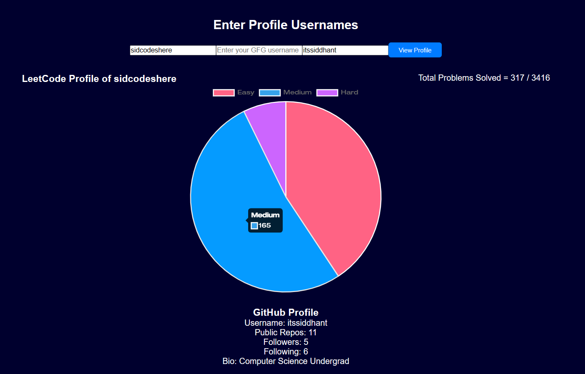
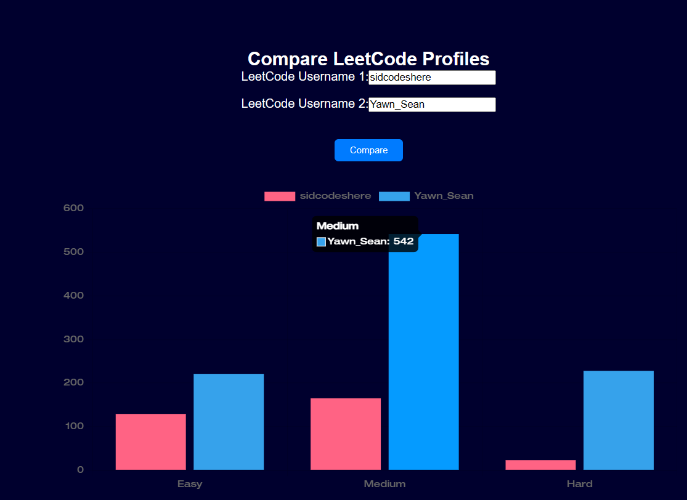

# CodeNet

## Description

The CodeNet is a web application that allows users to view and compare their coding profiles across multiple platforms, including LeetCode, GitHub, and GeeksforGeeks. Users can analyze their performance, compare different profiles, and visualize their achievements through various charts and graphs.

## Screenshot

There are two views, Personal Profile View and Comparing View.
This is the Profile View


This is Comparing View


## Features

- **Personal Profile View**: Displays detailed statistics and visualizations for a single profile from LeetCode, including solved vs. total questions for easy, medium, and hard levels.
- **Profile Comparison**: Compare coding profiles between two or more users, including LeetCode, GitHub, and GeeksforGeeks.
- **Charts and Graphs**: Visualize coding data using pie charts and bar graphs.
- **Modal for User Input**: A modal allows users to enter or edit their profile details.

## Technologies Used

- **React**: For building the user interface.
- **Chart.js**: For creating charts and graphs.
- **Bootstrap**: For styling and responsive design.
- **Axios**: For making HTTP requests to fetch profile data.

## Setup

1. **Clone the Repository**

   ```bash
   git clone https://github.com/itssiddhant/CodeNet.git
   cd codenet

2. **Install Dependencies**
   ```bash
   npm install

3. **Run the Application**
   ```bash
   npm start

    This will open the localhost:3000 in your web browser

## Configuration

- **LeetCode API**: Fetch profile data from the LeetCode API. Ensure to replace any placeholder URLs or API keys if needed.
- **GitHub API**: Fetch GitHub profile data. Make sure your API keys and endpoint configurations are set correctly.
- **GeeksforGeeks API**: Fetch data from the GeeksforGeeks API. Ensure proper API integration.

## Components

- **`App.js`**: Main component that handles the application logic and renders different views.
- **`UsernameInput.js`**: Component for entering and submitting usernames for different platforms.
- **`CompareInputs.js`**: Component for comparing profiles between multiple users and displaying the comparison results.

## Code Structure

- **`src/`**: Contains all the source code for the application.
  - **`components/`**: Contains React components like `UsernameInput`, `CompareInputs`, etc.
  - **`services/`**: Contains service files to fetch data from APIs (e.g., `leetcodeService.js`, `githubService.js`, `gfgService.js`).
  - **`App.js`**: Main entry point of the application.
  - **`index.js`**: Application entry point that renders `App.js`.
  - **`App.css`**: Styles specific to the application.

## Contributing

If you'd like to contribute to the project, please follow these steps:

1. Fork the repository.
2. Create a new branch (`git checkout -b feature-branch`).
3. Commit your changes (`git commit -am 'Add new feature'`).
4. Push to the branch (`git push origin feature-branch`).
5. Create a new Pull Request.

## License

This project is licensed under the MIT License - see the [LICENSE](LICENSE) file for details.

## Contact

If you have any questions or feedback, feel free to contact me at
sidcodeshere@gmail.com